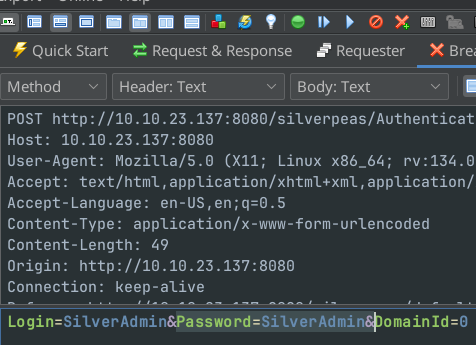
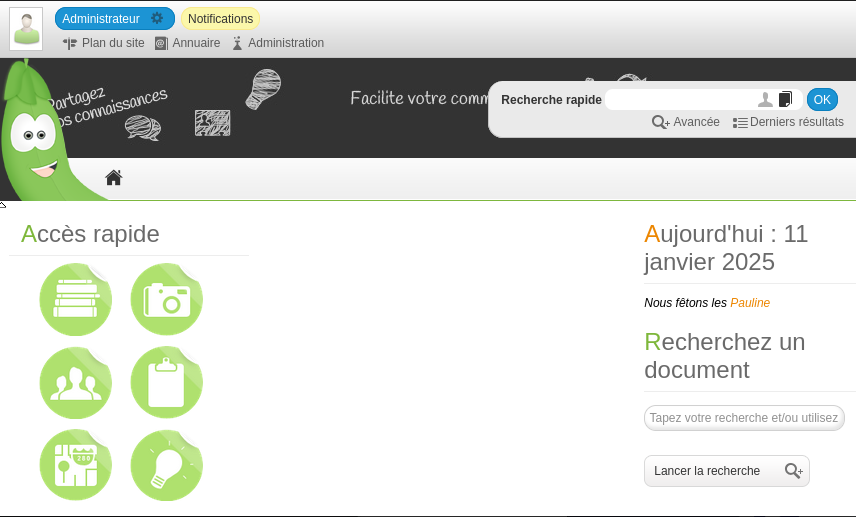
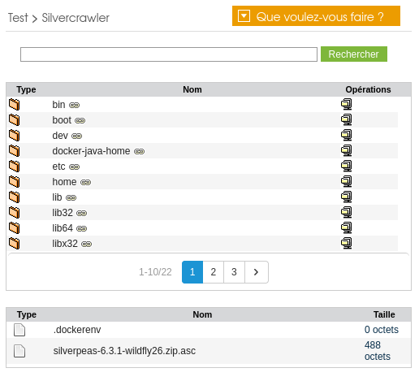

# Background

* Challenge name: Silver Platter
* Date published: January 10, 2025
* URL: <https://tryhackme.com/r/room/silverplatter>
# Intro

Think you've got what it takes to outsmart the Hack Smarter Security team? They claim to be unbeatable, and now it's your chance to prove them wrong. Dive into their web server, find the hidden flags, and show the world your elite hacking skills. Good luck, and may the best hacker win!

But beware, this won't be a walk in the digital park. Hack Smarter Security has fortified the server against common attacks and their password policy requires passwords that have not been breached (they check it against the rockyou.txt wordlist - that's how 'cool' they are). The hacking gauntlet has been thrown, and it's time to elevate your game. Remember, only the most ingenious will rise to the top. 

May your code be swift, your exploits flawless, and victory yours!
# Recon

Launch nmap to see what ports are open:

```shell
sudo nmap -r -n -sV -sS -sC -vv --open --reason -p- <TARGET_IP> -oN nmap-banners.txt
```

There's an HTTP server on port 8080. Scan it using your preferred tool (wfuzz, ffuf...) and your preferred URI wordlist (i.e. raft). I use feroxbuster:

```shell
feroxbuster --url http://<TARGET_IP>:8080/ -t 64 -w <URL_WORDLIST> -o feroxbuster_8080_silverpeas.txt --filter-status 404
```

There's a folder called /weblib, which has a robots.txt file:


This tells that there's a Silverpeas application in the server.

# Initial access

To get initial access, you need to exploit [CVE-2024-36042](https://gist.github.com/ChrisPritchard/4b6d5c70d9329ef116266a6c238dcb2d). This vulnerability can be exploited by removing the Password field from the HTTP POST request to the server, so you need an intercepting HTTP proxy that allows to intercept and modify requests. In this case, ZAP.

Launch ZAP and go to "Manual Explore", enter the login URL and launch browser:


Then set a breakpoint for request interception/modification. Press "Add a custom HTTP breakpoint..." in the top bar (the red X and green plus sign button):


In the following window, in Match, select Contains, and in String, put `silverpeas/AuthenticationServlet`, which is the part of the POST URI that ZAP will monitor for interception. Then click Save.


Now login using the user/pass combo SilverAdmin/SilverAdmin. When clicking "LOG IN", ZAP will intercept and show the POST request. Remove the "Password" field and then press the Play button on the top:



There will be another interception. Press the Play button again. The SilverPeas screen will come up, in French:



Go to "Administration", and then "Utilisateurs & groupes". In the drop-down on the left side, select "domainSilverpeas". You will see 3 users[^french]:


Logout ("Se déconnecter"), and then do the same login bypass, but with the Manager user this time. Manager uses the application in english, and there's an interesting notification on the top. Open and expand:


Now connect to the SSH server with those credentials, and retrieve the flag:


# Privilege escalation

There are two users in /home:


When reviewing the /etc/passwd file, the tyler user has an interesting comment, that suggests that he has some above-than-normal privileges:


Back to the SilverPeas application, there's a [file read vulnerability in its Silvercrawler module](https://rhinosecuritylabs.com/research/silverpeas-file-read-cves/). Log out and in again as SilverAdmin this time, using the CVE-2024-36042 vulnerability, go to Administration and press "Créer un espace" (Create a space), give it a name (Nom), then click "Valider" (Validate), then add an application ("Ajouter une application"), then select "Connecteurs" (Connectors), and then Silvercrawler:


In the following screen, give the application a name (i.e., Silvercrawler), check "Accès public", and set "Répertoire de base" to /. Then click "Valider":


Then select "Accéder à l'espace":


Then click "Silvercrawler". You'll have access to the machine's entire filesystem:



Navigate to /opt/silverpeas/configuration and download the application's config.properties file:


This file has the application's database configuration, including the database's password. Reuse it to access tyler's SSH account, then check his sudo privileges, which are ALL. Do a `sudo su` and check the flag.


[^french]: If you want, you can change the language of SilverAdmin to english. Click on him and change his language there, but you'll need to logout and login again to
see the changes.
